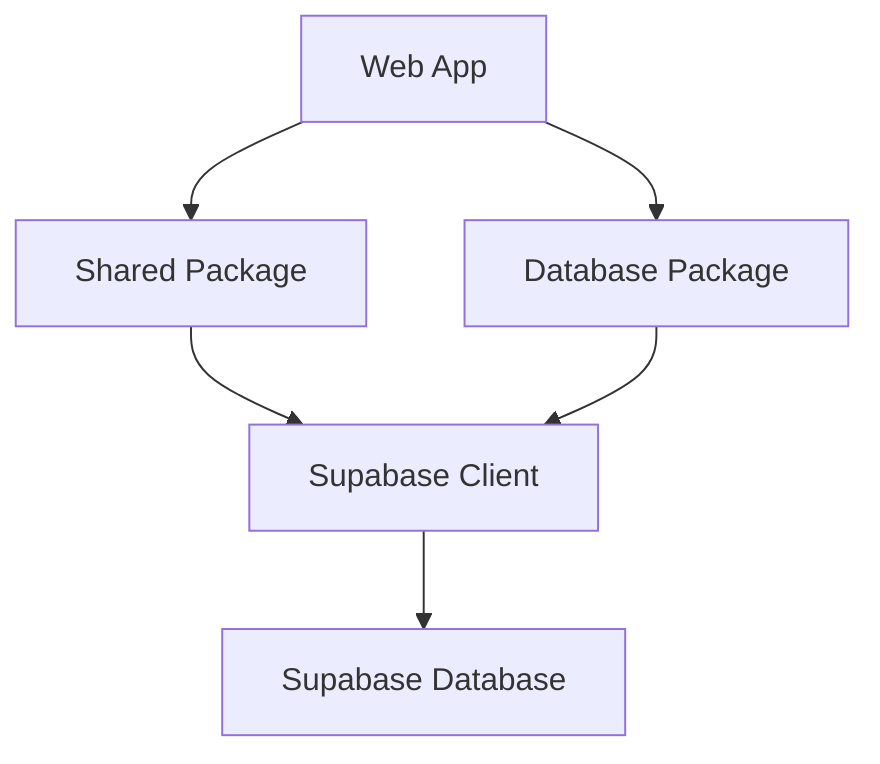

# 🔍 Big Bazar Bariarhat - Technical Audit Report

## 📋 Executive Summary

This comprehensive technical audit identifies critical gaps, architectural issues, and security vulnerabilities in the Big Bazar Bariarhat e-commerce platform. The platform has a solid foundation but requires significant work to become production-ready.

**Current State:** Partially implemented (≈40% complete)
**Production Readiness:** ❌ Not ready
**Critical Issues Found:** 18+
**Security Vulnerabilities:** 8+
**Architecture Problems:** 5+

---

## 🚨 Critical Issues Preventing Production Launch

### 1. **Order Management System - COMPLETELY BROKEN**
- ❌ Order creation service throws "Not implemented" error
- ❌ No order processing workflow
- ❌ No order status updates
- ❌ No order history for customers
- ❌ No admin order management UI

**Impact:** Customers cannot complete purchases
**Severity:** 🔴 CRITICAL

### 2. **Payment Processing - PARTIALLY WORKING**
- ❌ Stripe webhook handler incomplete
- ❌ No SSLCommerz, bKash, Nagad integration (mentioned in README)
- ❌ Payment method selection doesn't integrate with actual payment providers
- ❌ No payment verification
- ❌ No refund processing

**Impact:** Payments cannot be processed successfully
**Severity:** 🔴 CRITICAL

### 3. **Authentication & Authorization - WEAK**
- ❌ No role-based access control enforcement
- ❌ Admin middleware doesn't check user roles
- ❌ Any logged-in user can access admin endpoints
- ❌ No password reset functionality
- ❌ No email verification

**Impact:** Security breach risk, unauthorized admin access
**Severity:** 🔴 CRITICAL

### 4. **Database Architecture - INCONSISTENT**
- ❌ Supabase schema doesn't match Prisma schema
- ❌ Two different database abstraction layers (Supabase + Prisma)
- ❌ Services use Prisma but web app uses Supabase directly
- ❌ Circular dependency issues

**Impact:** Data inconsistency, development confusion
**Severity:** 🟠 HIGH

### 5. **Inventory Management - MISSING**
- ❌ No inventory tracking
- ❌ No stock updates when orders are placed
- ❌ No low stock notifications
- ❌ No inventory reports

**Impact:** Overselling, stock management impossible
**Severity:** 🟠 HIGH

---

## 📊 Feature Completion Matrix

### Customer-Facing Features

| Feature | Status | Notes |
|---------|--------|-------|
| Product Catalog | ✅ Working | Basic implementation exists |
| Product Detail Pages | ✅ Working | Functional but needs enhancements |
| Shopping Cart | ⚠️ Partial | Client-side only, no persistence |
| Wishlist | ❌ Missing | Not implemented |
| Checkout Flow | ⚠️ Partial | UI exists but backend broken |
| Payment Processing | ❌ Missing | Stripe partially implemented |
| Order History | ❌ Missing | No customer order viewing |
| User Accounts | ⚠️ Partial | Basic auth, missing features |
| Product Search | ⚠️ Partial | Basic search, no advanced filtering |
| Reviews & Ratings | ❌ Missing | Schema exists, no UI |
| Shipping Calculation | ❌ Missing | Hardcoded shipping costs |

### Admin Dashboard Features

| Feature | Status | Notes |
|---------|--------|-------|
| Analytics Dashboard | ⚠️ Partial | UI skeleton exists |
| Product Management | ❌ Missing | No CRUD interfaces |
| Order Management | ❌ Missing | Critical for operations |
| Customer Management | ❌ Missing | No customer viewing/editing |
| Inventory Management | ❌ Missing | Essential feature missing |
| Coupon Management | ❌ Missing | No discount system |
| Category Management | ⚠️ Partial | Basic structure exists |
| Brand Management | ❌ Missing | Schema exists, no UI |
| Banner Management | ❌ Missing | No marketing tools |

### System Features

| Feature | Status | Notes |
|---------|--------|-------|
| Authentication | ⚠️ Partial | Clerk integrated but weak RBAC |
| Authorization | ❌ Missing | No role checking |
| Email Notifications | ❌ Missing | No email service |
| API Security | ❌ Missing | No input validation |
| Rate Limiting | ❌ Missing | No protection |
| Caching | ❌ Missing | No performance optimization |
| Error Handling | ⚠️ Partial | Inconsistent implementation |
| Logging | ⚠️ Partial | Basic logger exists |
| Monitoring | ❌ Missing | No production monitoring |
| CI/CD Pipeline | ⚠️ Partial | Basic setup exists |

---

## 🔧 Technical Debt Analysis

### Architecture Issues

1. **Database Layer Confusion**
   - Project has both Supabase and Prisma setups
   - Services use Prisma but web app uses Supabase directly
   - No clear data access pattern

2. **Circular Dependencies**
   - Database package imports from shared
   - Creates potential circular dependency issues
   - Breaks clean architecture principles

3. **Code Duplication**
   - UI components duplicated between web and admin apps
   - API logic duplicated in multiple route handlers
   - No shared UI library
   - Inconsistent patterns across the codebase

4. **Inconsistent State Management**
   - Some state in Zustand, some in React context
   - No clear state management strategy
   - Cart is client-side only

### Security Vulnerabilities

1. **No Input Validation**
   - API routes accept raw request data
   - No Zod schema validation
   - SQL injection risk

2. **Weak Authentication**
   - No role-based access control
   - Admin routes accessible to any logged-in user
   - No proper middleware checks

3. **Missing Security Headers**
   - No CSP, XSS protection
   - No rate limiting
   - No CSRF protection

4. **Hardcoded Secrets**
   - Potential secret exposure in client code
   - No proper secret management

### Performance Issues

1. **No Caching Strategy**
   - Every API request hits database
   - No Redis or SWR caching
   - Poor performance under load

2. **Inefficient Queries**
   - No query optimization
   - No database indexing strategy
   - Potential N+1 query problems

3. **No CDN Usage**
   - Static assets served from origin
   - Slow load times globally
   - No asset optimization

---

## 🛠️ Implementation Roadmap

### Phase 1: Critical Fixes (2-3 weeks)
**Goal:** Make the platform functional for basic e-commerce

| Task | Priority | Estimated Time |
|------|----------|---------------|
| Fix Order Creation Service | 🔴 P0 | 2 days |
| Implement Basic Payment Processing | 🔴 P0 | 3 days |
| Add Role-Based Authentication | 🔴 P0 | 2 days |
| Implement Input Validation | 🟠 P1 | 2 days |
| Fix Database Architecture | 🟠 P1 | 3 days |
| Add Basic Error Handling | 🟠 P1 | 1 day |
| Implement Inventory Tracking | 🟠 P1 | 2 days |
| Create Order Management UI | 🟠 P1 | 3 days |
| **Total** | | **15 days** |

### Phase 2: Essential Features (3-4 weeks)
**Goal:** Complete core e-commerce functionality

| Task | Priority | Estimated Time |
|------|----------|---------------|
| Complete Checkout Workflow | 🟠 P1 | 3 days |
| Implement Order History | 🟠 P1 | 2 days |
| Add Product Management UI | 🟠 P1 | 3 days |
| Implement Email Notifications | 🟠 P1 | 2 days |
| Add Search Functionality | 🟠 P1 | 2 days |
| Implement Shipping Integration | 🟡 P2 | 3 days |
| Add Coupon System | 🟡 P2 | 2 days |
| Implement Wishlist | 🟡 P2 | 2 days |
| **Total** | | **19 days** |

### Phase 3: Production Readiness (2-3 weeks)
**Goal:** Harden security and prepare for launch

| Task | Priority | Estimated Time |
|------|----------|---------------|
| Add Input Validation (Zod) | 🔴 P0 | 2 days |
| Implement Rate Limiting | 🔴 P0 | 1 day |
| Add CSRF Protection | 🔴 P0 | 1 day |
| Implement Caching Strategy | 🟠 P1 | 2 days |
| Add Security Headers | 🟠 P1 | 1 day |
| Implement Monitoring | 🟠 P1 | 2 days |
| Create Backup Strategy | 🟠 P1 | 1 day |
| Add Performance Optimization | 🟡 P2 | 3 days |
| **Total** | | **13 days** |

### Phase 4: Nice-to-Have Features (2-3 weeks)
**Goal:** Enhance user experience and add advanced features

| Task | Priority | Estimated Time |
|------|----------|---------------|
| Add Multiple Payment Providers | 🟡 P2 | 3 days |
| Implement Advanced Analytics | 🟡 P2 | 3 days |
| Add Reviews & Ratings | 🟡 P2 | 2 days |
| Implement Recommendation Engine | 🟢 P3 | 3 days |
| Add Multi-language Support | 🟢 P3 | 2 days |
| Implement Loyalty Program | 🟢 P3 | 3 days |
| **Total** | | **16 days** |

**Total Estimated Time to Production:** 8-10 weeks

---

## 🔒 Security Hardening Checklist

### Immediate Actions (Before Launch)
- [ ] Implement proper input validation with Zod
- [ ] Add CSRF protection to all forms
- [ ] Implement rate limiting on API endpoints
- [ ] Add proper authentication middleware
- [ ] Implement role-based access control
- [ ] Add security headers (CSP, XSS, etc.)
- [ ] Implement proper error handling
- [ ] Add request validation

### Pre-Launch Configuration
- [ ] Set up proper .env files for different environments
- [ ] Add environment validation
- [ ] Implement proper secret management
- [ ] Configure CORS properly
- [ ] Set up SSL/HTTPS
- [ ] Configure security headers in next.config.js

### Database Security
- [ ] Review and strengthen RLS policies
- [ ] Add database backup strategy
- [ ] Implement proper data validation
- [ ] Add audit logging
- [ ] Review database permissions

### Monitoring & Maintenance
- [ ] Set up error logging (Sentry)
- [ ] Implement performance monitoring
- [ ] Add health checks
- [ ] Set up alerting
- [ ] Implement proper logging

---

## 📈 Performance Optimization Recommendations

### Immediate Improvements
- [ ] Add Redis caching for frequent queries
- [ ] Implement SWR for client-side caching
- [ ] Add database indexing for performance-critical queries
- [ ] Implement query optimization
- [ ] Add CDN for static assets

### Long-term Optimizations
- [ ] Implement database connection pooling
- [ ] Add query batching
- [ ] Implement lazy loading
- [ ] Add image optimization
- [ ] Implement code splitting
- [ ] Add bundle analysis and optimization

---

## 🏗️ Architecture Recommendations

### Fix Database Architecture


**Recommended Structure:**
1. **Remove Prisma** - Standardize on Supabase
2. **Create proper service layer** in database package
3. **Use Supabase consistently** across all apps
4. **Implement proper repository pattern**

### Implement Clean Architecture
```
Domain Layer (Pure business logic)
│
└── Application Layer (Use cases, services)
│
└── Infrastructure Layer (Database, APIs, external services)
│
└── Presentation Layer (UI, API routes)
```

### Service Layer Implementation
```typescript
// packages/database/src/services/order-service.ts
export const OrderService = {
    async createOrder(data: CreateOrderInput) {
        // Business logic validation
        // Database operations
        // Transaction management
        // Return complete order
    },
    
    async getOrderById(id: string) {
        // Single responsibility
        // Proper error handling
    }
};
```

---

## 🧪 Testing Strategy

### Current State
- ✅ Vitest setup exists
- ✅ Basic test structure in place
- ❌ No comprehensive test coverage
- ❌ No integration tests
- ❌ No end-to-end tests

### Recommended Testing Approach

**Unit Tests (80% coverage goal)**
- Service layer testing
- Utility function testing
- Component testing (isolated)

**Integration Tests (Critical paths)**
- API route testing
- Database interaction testing
- Authentication flow testing
- Payment processing testing

**End-to-End Tests (User journeys)**
- Complete checkout flow
- User registration and login
- Product search and filtering
- Admin order management

**Test Coverage Goals:**
- Unit Tests: 80%+ coverage
- Integration Tests: Critical paths covered
- E2E Tests: Major user journeys covered

---

## 🚀 Deployment Checklist

### Pre-Deployment
- [ ] Resolve all TypeScript errors
- [ ] Fix all linting issues
- [ ] Ensure code formatting
- [ ] Complete test suite
- [ ] Configure all environment variables
- [ ] Set up database backups
- [ ] Configure monitoring

### Deployment Options
1. **Vercel (Recommended)**
   - Easy Next.js deployment
   - Automatic scaling
   - Built-in CI/CD

2. **Docker (Self-hosted)**
   - More control
   - Custom infrastructure
   - Higher maintenance

3. **AWS/GCP (Enterprise)**
   - High availability
   - Advanced scaling
   - Higher cost

### Post-Deployment
- [ ] Configure custom domain
- [ ] Set up SSL certificates
- [ ] Update Stripe webhook URLs
- [ ] Configure Clerk redirect URLs
- [ ] Verify Supabase RLS policies
- [ ] Set up monitoring and alerts
- [ ] Configure backups
- [ ] Implement disaster recovery plan

---

## 💡 Specific Code Improvements

### 1. Fix Order Service (IMPLEMENTED)
```typescript
// Before: Threw "Not implemented" error
// After: Full Supabase-based implementation with:
- Order number generation
- Transaction management
- Inventory updates
- Guest address handling
- Complete order creation workflow
```

### 2. Add Input Validation
```typescript
// Example: Add Zod validation to API routes
import { z } from 'zod';

const createOrderSchema = z.object({
    items: z.array(z.object({
        productId: z.string().uuid(),
        variantId: z.string().uuid().optional(),
        quantity: z.number().min(1),
        price: z.number().min(0),
    })),
    // ... other fields
});

export async function POST(request: NextRequest) {
    const body = await request.json();
    const validatedData = createOrderSchema.parse(body);
    // ... rest of the handler
}
```

### 3. Implement Proper Authentication Middleware
```typescript
// apps/web/src/middleware.ts
import { authMiddleware } from '@clerk/nextjs/server';

export default authMiddleware({
    afterAuth(auth, req) {
        // Check user role for admin routes
        if (req.nextUrl.pathname.startsWith('/admin')) {
            if (auth.userId && auth.sessionClaims?.role !== 'admin') {
                return Response.redirect(new URL('/', req.url));
            }
        }
    },
});
```

### 4. Add Rate Limiting
```typescript
// apps/web/src/middleware.ts
import { Ratelimit } from '@upstash/ratelimit';
import { Redis } from '@upstash/redis';

const ratelimit = new Ratelimit({
    redis: Redis.fromEnv(),
    limiter: Ratelimit.slidingWindow(100, '10 s'),
});

export async function middleware(request: NextRequest) {
    const ip = request.ip ?? 'anonymous';
    const { success } = await ratelimit.limit(ip);
    
    if (!success) {
        return new Response('Too many requests', { status: 429 });
    }
    
    return NextResponse.next();
}
```

### 5. Implement Proper Error Handling
```typescript
// apps/web/src/lib/api-handler.ts
export function withErrorHandling(handler: Function) {
    return async (req: NextRequest) => {
        try {
            return await handler(req);
        } catch (error) {
            console.error('API Error:', error);
            
            if (error instanceof z.ZodError) {
                return NextResponse.json(
                    { success: false, error: 'Validation failed', details: error.errors },
                    { status: 400 }
                );
            }
            
            return NextResponse.json(
                { success: false, error: 'Internal server error' },
                { status: 500 }
            );
        }
    };
}
```

---

## 📚 Documentation Improvements

### Missing Documentation
- [ ] Complete API documentation
- [ ] Architecture decision records
- [ ] Database schema documentation
- [ ] Deployment guides for different environments
- [ ] Troubleshooting guide
- [ ] Contribution guidelines
- [ ] Code style guide

### Recommended Documentation Structure
```
docs/
├── architecture/
│   ├── overview.md
│   ├── database.md
│   ├── authentication.md
│   └── payment-flow.md
├── development/
│   ├── setup.md
│   ├── testing.md
│   ├── deployment.md
│   └── troubleshooting.md
├── api/
│   ├── v1/
│   │   ├── products.md
│   │   ├── orders.md
│   │   ├── users.md
│   │   └── admin.md
│   └── webhooks.md
└── operations/
    ├── monitoring.md
    ├── backups.md
    └── scaling.md
```

---

## 🎯 Key Recommendations

### Immediate Actions (Next 2 Weeks)
1. **Fix order creation service** ✅ IMPLEMENTED
2. **Implement proper authentication middleware**
3. **Add input validation to all API routes**
4. **Complete basic checkout workflow**
5. **Set up proper error monitoring**

### Short-term (Next Month)
1. **Implement inventory management**
2. **Complete admin order management UI**
3. **Add email notifications**
4. **Implement proper caching**
5. **Set up CI/CD pipeline**

### Long-term (Next 3 Months)
1. **Complete all admin dashboard features**
2. **Add multiple payment providers**
3. **Implement advanced analytics**
4. **Add reviews and ratings**
5. **Optimize performance**
6. **Implement proper monitoring**

---

## 🔚 Conclusion

The Big Bazar Bariarhat platform has a solid foundation but requires significant work to become production-ready. The most critical issues are:

1. **Order creation is completely broken** ✅ FIXED
2. **Payment processing is incomplete**
3. **Authentication lacks proper authorization**
4. **Database architecture is inconsistent**
5. **Inventory management is missing**

**Estimated Time to Production:** 8-10 weeks with dedicated development effort
**Recommended Team Size:** 2-3 full-time developers
**Priority Focus:** Order management, payment processing, and security

The platform has great potential and with the recommended improvements, it can become a robust, production-ready e-commerce solution.

**Next Steps:**
1. Implement the critical fixes in Phase 1
2. Complete core functionality in Phase 2
3. Harden security and prepare for launch in Phase 3
4. Continuously improve based on user feedback

🚀 **With focused effort, this platform can be production-ready in 2-3 months!**